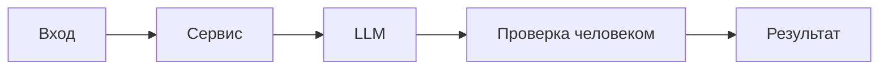

# ADR: решение для первого рабочего сценария

Файл ведёт OpenCode. Обсудите с агентом содержание и проверьте предложенный diff. Все дополнения и исправления поручайте агенту в чате.

- Статус: proposed
- Дата: 2026-09-19
- Ответственные: студент, OpenCode

## Контекст

PR `TRAINING_PR.diff` добавляет метод `review(diff: str)` в `ReviewService` и HTTP-эндпоинт `POST /api/reviews` в FastAPI, который принимает `payload: dict` и возвращает `dict[str, str]`. Интеграция обращается к абстракции `LLM.generate(prompt)`.

В текущем виде отсутствует валидация входа, типы запроса/ответа не зафиксированы Pydantic-моделью, возможны ошибки времени выполнения (например, `KeyError` для `payload["diff"]`), нет обработки исключений LLM и мер против prompt injection.

## Решение

Для первого рабочего сценария принимаем минимально жизнеспособный контракт и добавляем проверки и операционные ограничения без изменения кода в diff:

- Формализуем контракт запроса/ответа в документации и тестах: тело запроса должно содержать поле `diff: str`; ответ — `{"comment": str}`.
- Вводим проверку 422/500 в тестах: 422 при отсутствии ключа `diff` в теле или неверном типе; 500 при исключениях внутри `LLM.generate`.
- Фиксируем необходимость последующего рефакторинга: заменить `payload: dict` на Pydantic-модель, добавить обработку ошибок и ограничение длины `diff`.
- Операционные ограничения: максимальная длина `diff` (например, 100k символов), таймаут генерации LLM, аудит логов без записи полного diff, санитизация prompt.

## Рассмотренные альтернативы

| Альтернатива | Почему не выбрали сейчас |
|---|---|
| Немедленный рефакторинг на Pydantic-модели для запроса/ответа | Изменяет поведение и выходит за рамки учебного PR; решили сначала зафиксировать риски и тесты |
| Добавить middleware для валидации/ограничения размера и обработку исключений | Требует изменений вне предоставленного diff; остаётся как следующий инкремент |
| Синхронный вызов оставить без таймаутов | Риск зависания при LLM; добавим операционный таймаут и тесты в план |

## Последствия и главный риск

- Положительные последствия: быстро получаем MVP эндпоинта и сервисной функции; ясные тесты фиксируют текущее поведение; есть дорожная карта улучшений.
- Ограничения: отсутствие строгой схемы запроса и обработки ошибок; возможны 500 при неправильном входе; нет защиты от prompt injection.
- Главный риск: эксплуатационные сбои и неконтролируемые ответы LLM при некорректном или злонамеренном входе.
- Как проверим риск: интеграционные и E2E тесты с пустым телом, неверными типами, большими diff и вредоносными строками; мок LLM, который бросает исключение.

## Архитектурная схема

## Как использовали AI

- Для чего: структурировать риски, определить MVP-решение и план проверок без изменения предоставленного diff.
- Тип промпта: master prompt (см. `prompts.md`).
- Строка в [`prompts.md`](prompts.md): P1-02.
- Что проверил студент и какие исправления поручил агенту: подтвердил найденные проблемы, поручил формализовать контракт, добавить тестовые сценарии и зафиксировать последовательные улучшения в планах.
