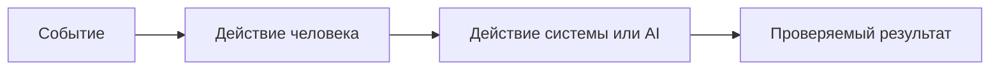

# Анализ процесса: AS IS и TO BE

Файл ведёт OpenCode. Обсудите с агентом содержание и проверьте предложенный diff. Все дополнения и исправления поручайте агенту в чате.

## AS IS

Расскажите OpenCode о текущем процессе. Попросите агента описать участников, задержки, ручные операции и точки потери информации.

Участники: разработчик, ревьюер, сервис `ReviewService` с абстракцией `LLM`, HTTP API FastAPI.

Процесс сейчас:
- Разработчик отправляет PR; дифф передают в сервис как сырой текст `diff: str`.
- Сервис синхронно формирует prompt и вызывает `LLM.generate`.
- Ответ LLM возвращается как `{"comment": str}` без постобработки, валидации и трассировки.

Задержки и ручные операции:
- Синхронный запрос к LLM может блокировать обработку HTTP-запроса; нет таймаута.
- Ревьюер вручную проверяет корректность комментария, нет структурированных метаданных.

Точки потери информации:
- Нет схемы запроса/ответа, тело запроса не валидируется; ошибки отображаются как 500.
- Не фиксируются параметры вызова, длина и свойства диффа.

## TO BE

Обсудите с OpenCode один процесс после изменения. Поручите агенту описать его в BPMN, DFD или IDEF*. Если GitHub не отображает выбранный формат, агент сохраняет рядом исходник и PNG и добавляет ссылки.

Конкретизация TO BE для MVP+1 инкремента:
- Вводим Pydantic-схему `ReviewRequest{ diff: str }`, `ReviewResponse{ comment: str }`.
- Ограничиваем размер `diff` и время генерации; добавляем обработку исключений и возврат 422/400/504.
- Логируем только хэш diff и длину; сохраняем трассировку для отладки.

## Разница

| Что меняется | AS IS | TO BE | Как проверим изменение |
|---|---|---|---|
| Валидация входа | Произвольный dict | Pydantic-модель с 422 | Интеграционный тест с пустым телом и неверным типом |
| Обработка ошибок LLM | 500 без контекста | Обёртка и коды 5xx/504 | Мок, бросающий исключение; ожидаемый статус |
| Лимиты | Нет | Ограничение размера и таймаут | Нагрузочный тест на большой diff и долгий мок |
| Трассируемость | Нет | Идентификатор запроса и санитизация | Проверка логов/метаданных в тестовой среде |

## Как использовали AI

- Для чего: зафиксировать текущее состояние и желаемые изменения процесса в терминах рисков и проверок.
- Тип промпта: task design на основе master prompt.
- Строка в [`prompts.md`](prompts.md): P1-03.
- Что проверил студент и какие исправления поручил агенту: подтвердил узкие места и запросил проверяемые сценарии и метрики для сравнения AS IS и TO BE.
