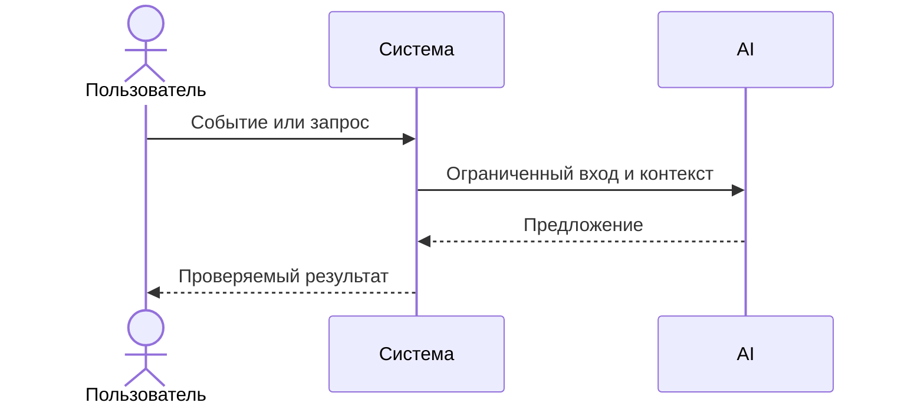

# Use cases и user stories

Файл ведёт OpenCode. Обсудите с агентом содержание и проверьте предложенный diff. Все дополнения и исправления поручайте агенту в чате.

## Первый рабочий сценарий

**Когда** пользователь отправляет HTTP POST на `/api/reviews` с телом `{ "diff": "..." }`, **система** формирует подсказку и вызывает `LLM.generate`, **а пользователь получает** JSON `{ "comment": "..." }`.

Не входит в этот сценарий:

- Валидация схемой, асинхронная обработка, защита от prompt injection — это последующие инкременты.

## Use case

| Поле | Значение |
|---|---|
| Актор | Клиент сервиса (CI/CD, разработчик) |
| Триггер | Запрос POST /api/reviews с телом JSON |
| Предусловия | Тело содержит ключ diff со строкой git diff |
| Основной результат | Возвращён `{"comment": str}` — текст ревью |
| Ошибка или отказ | При отсутствии diff — 500 в AS IS; в TO BE — 422 |



## User stories и acceptance criteria

```gherkin
Feature:

  Scenario: Позитивный
    Given корректное тело запроса с полем diff как строка
    When отправляем POST /api/reviews
    Then получаем 200 и JSON с ключом comment (строка)

  Scenario: Негативный или граничный
    Given пустое тело запроса или diff не строка
    When отправляем POST /api/reviews
    Then в AS IS получаем 500; в TO BE ожидаем 422
```

## Как использовали AI

- Для чего: сформулировать сценарий использования и критерии приемки.
- Тип промпта: task design.
- Строка в [`prompts.md`](prompts.md): P1-03.
- Что проверил студент и какие исправления поручил агенту: уточнил границы сценария и негативные кейсы.
